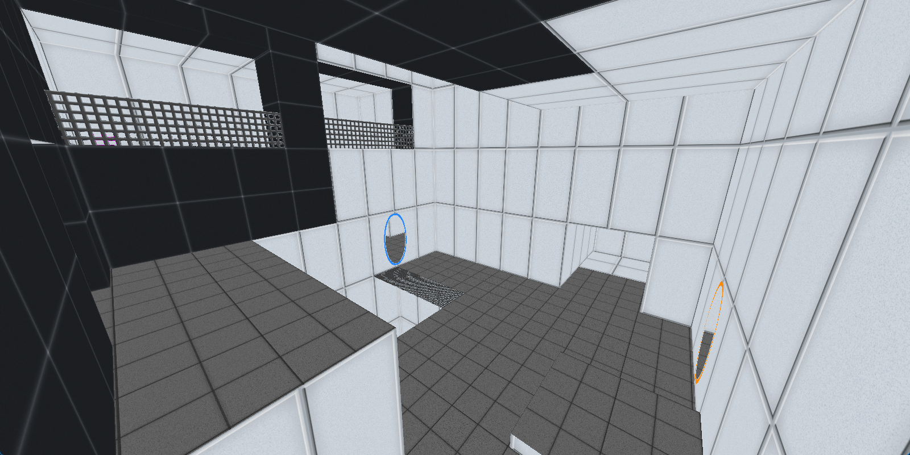
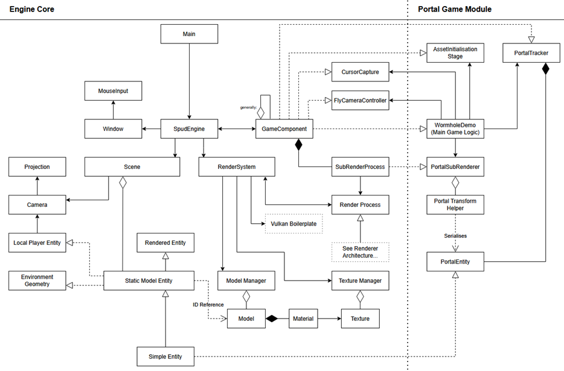
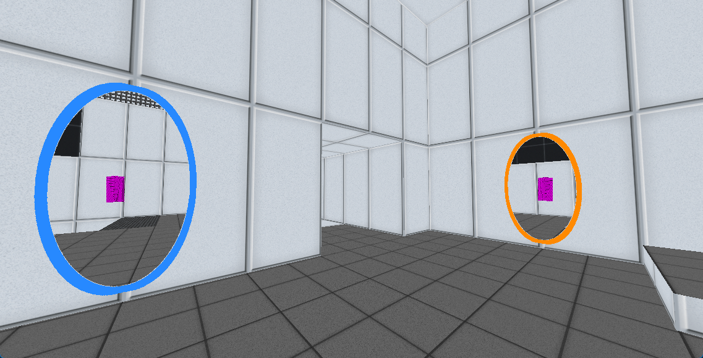

# SpudEngine
> A modular engine first built to create Portal, but with Geometry Shaders and Vulkan.
---

This engine is built to be modular, but it had the alternative goal of providing all the methods to recreate the Portals 
from Valve's game series "Portal", in its own isolated submodule.

The renderer is based on Vulkan utilising LWJGL's bindings. It handles all logic through a selection of
"GameComponents", allowing chunks of logic to be reused across multiple projects & combined when necessary.
Furthermore, the majority of the renderer can be swapped out without any modification to the engine's
source code. This is used in the Portal submodule to switch between the three different renderer implementations.

---

## Background

This project represents the technical portion of my undergraduate dissertation titled "Evaluating Rendering Techniques & 
Optimisations for Non-Euclidean Environments". A partial sample can be found 
[in the project's docs](docs/portal_research/FinalReportSample.pdf), but if you would like the full copy, please reach out.

For the sake of not having my email scraped, please contact me on:

- **Discord:** @cg360
- **LinkedIn:** /in/will-scully

---

## Wormhole / Portal Demo Project

For information on how to use the Wormhole subproject, see [docs/wormhole_project_guide.md](docs/portal_research/wormhole_project_guide.md)

## Credits

This project is built on top of the base renderer from the [lwjglgamedev/vulkanbook Project](https://github.com/lwjglgamedev/vulkanbook)

There's a *lot* of setup for Vulkan and this book was a valuable resource - a massive thank you!